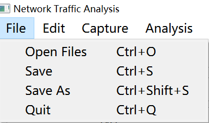

## File Management<!-- {docsify-ignore} -->

All about this function is in the menu bar `File` menu

### Opening file
The program allow you to open the .pcap file.

- Open one file
    * Just select the file you needed.
- Open multi-file
    * When you select numbers of file you needed, the list box will show the packets with the sequence of the packets you select.
  
Once you want to remove the content in the list box, please press the `stop button` in the toolbar.

### Saving file
Save the capture packets as a .pcap file.

- Save
  * Save the changes of currently file.

- Save As
  * Save the file everywhere in your local.