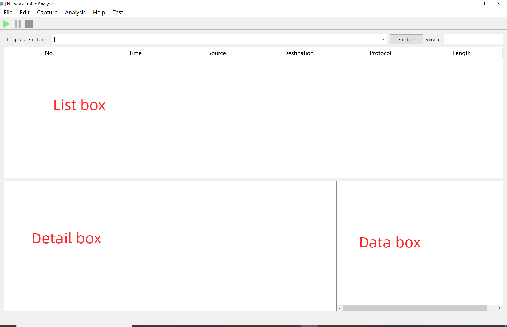
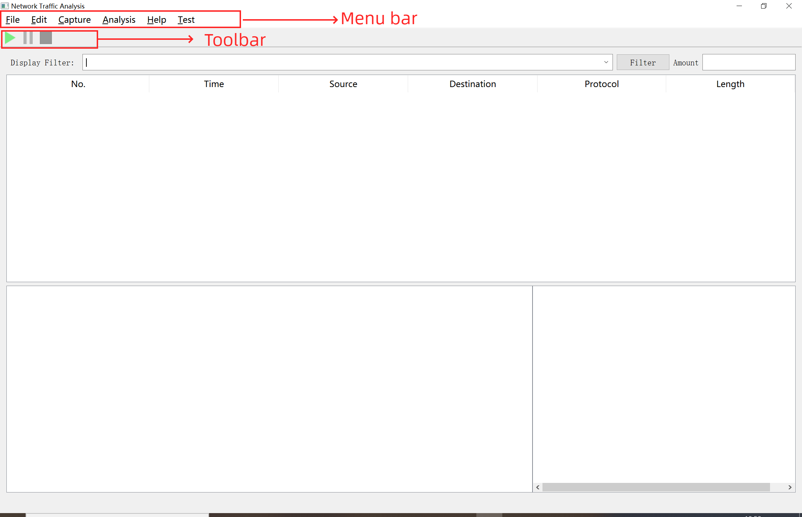
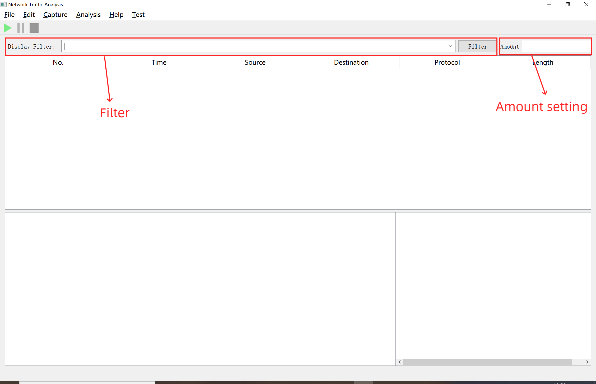

## GUI<!-- {docsify-ignore} -->

### Interface

The GUI of this application is shown below:

With the GUI has shown, there is mainly 3 windows in the interface:
- The top window (__list box__) used to show the list of the packets have been captured, with the basic detail of the packet (captured time, source, destination, protocol, packet length).
- The window in bottom left (__detail box__) is used to show the detail of the information about the selected packet.
- The window in bottom right (__data box__) is used to show the hexadecimal data information.

### Menu Bar

For the menu bar, you can use the shortcut `Alt + [The first capital letter of the menu word]`.
> Example: if you want to open file menu, please use `Alt + F`

### Toolbar
The toolbar is under the menu bar, it has 3 button: __start capture__, __pause to capture__, __capture halt__.

### Filter and capture amount setting
The bar under the toolbar has 2 text box, they respectively are the __filter__ and the __amount setting__.
- Filter
> Filter is used to filtering the packets have been capture or select what protocol of packets you want the application capture.

- Amount setting
> The amount setting box is used to set the amount of the packets you want the application to capture, if you do not set an exact number, the program will capture the packets until you pause it or halt it.

