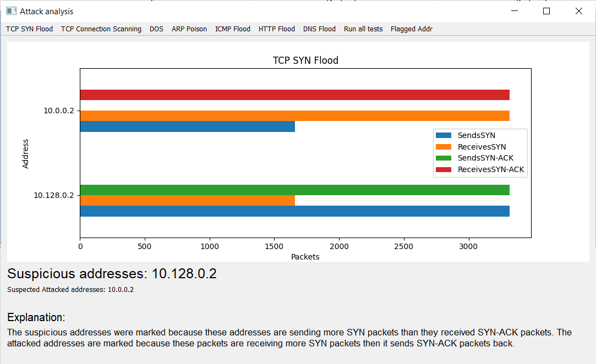
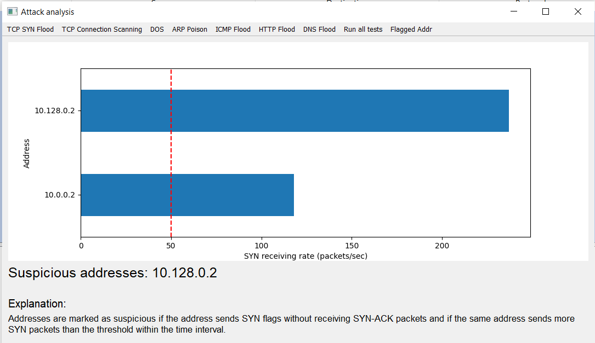
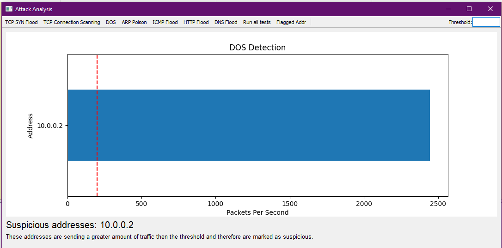
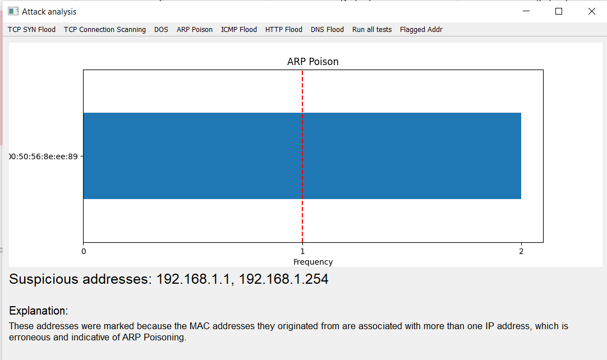
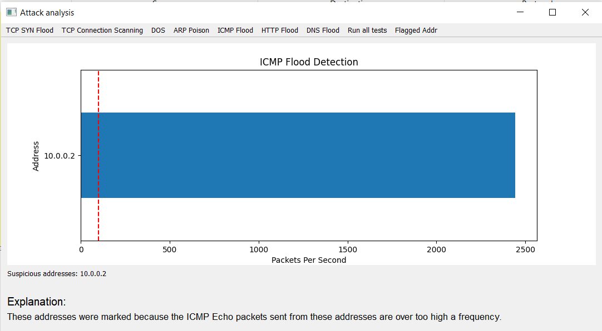
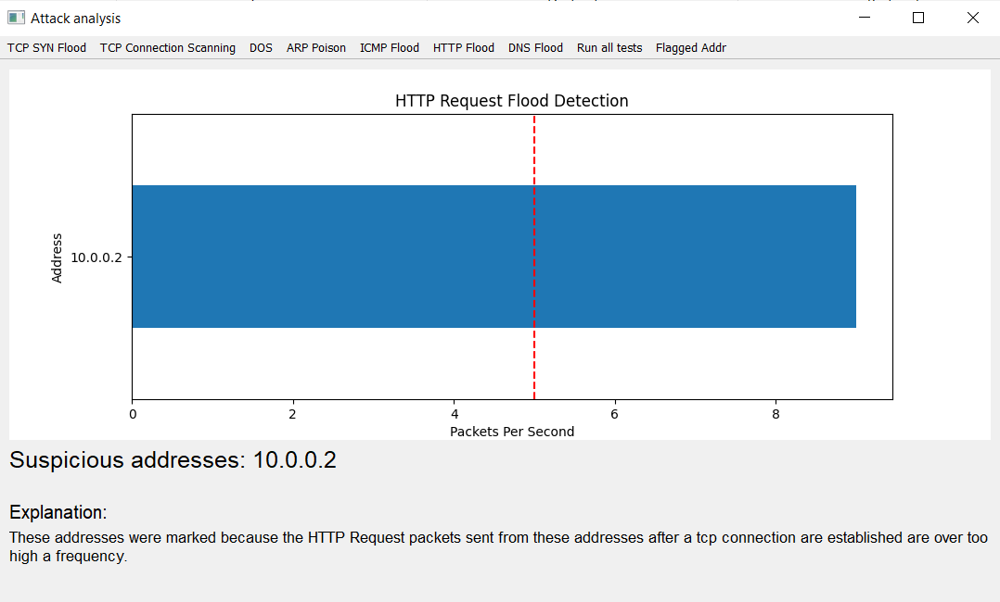
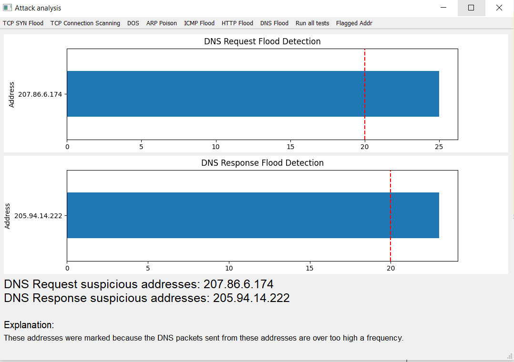
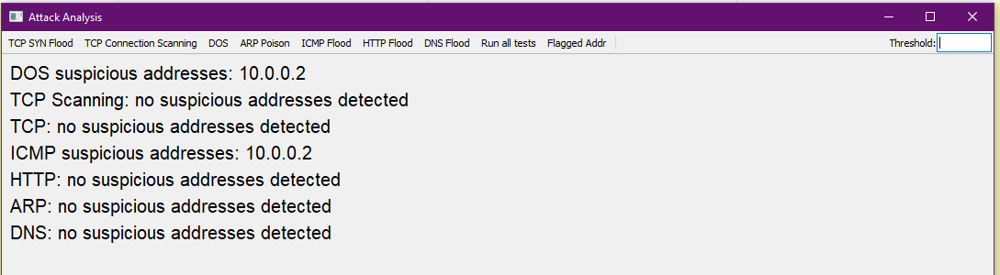
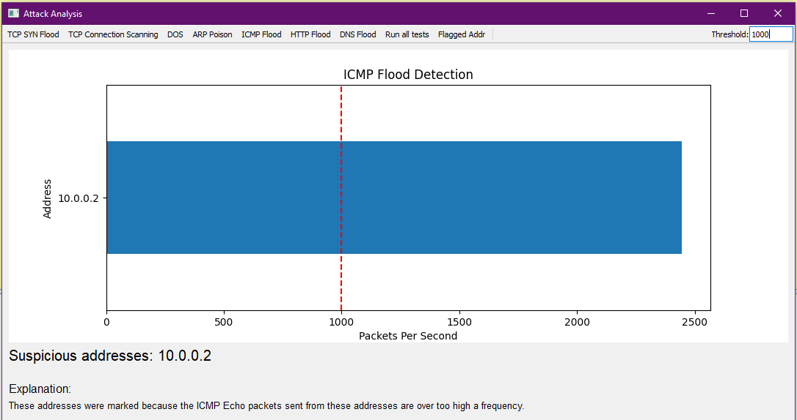
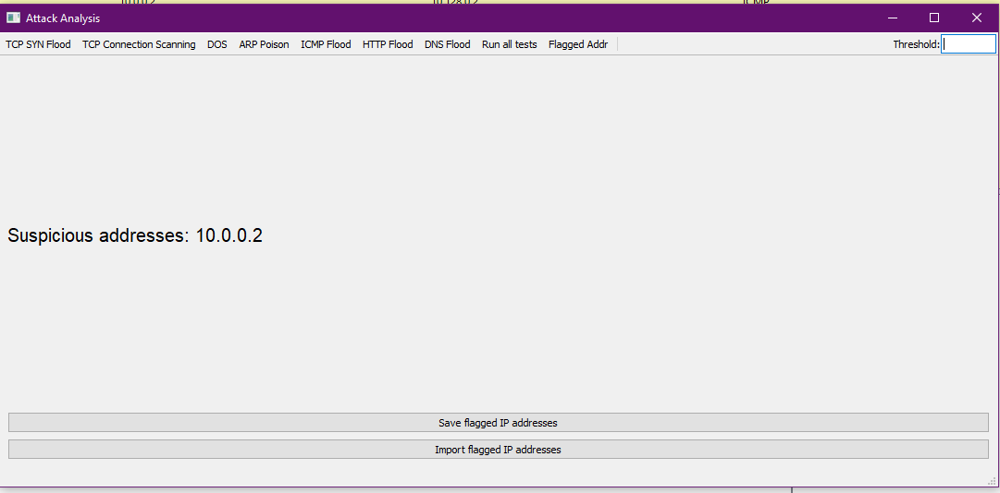

## Attack Analysis<!-- {docsify-ignore} -->

# Detection Methods

## TCP SYN Flood

## TCP Connect Scan

## DOS

## ARP Poison

## ICMP Flood

## HTTP Request Flood

## DNS Flood

## Test All
* Ability to run all tests at once

## Change Threshold
User can manually input threshold to effect:
* DOS
* ICMP Flood
* HTTP Request Flood
* DNS Flood

## Display Flagged IP
* Shows all previously flagged IP
* Can import or save flagged IP

