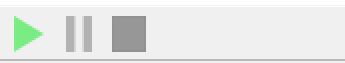

## Capture<!-- {docsify-ignore} -->

* To capture packets, used the **start button** on toolbar, when you want to stop capture, press the **pause button**. After capture all packets and want to remove the capture record, press the **stop button**.

* After capture the packets, you can press the packet you want in the list, then the bottom two windows will show the details and data.
* To turn the data in binary form, you can make a right click in the data box and select the ``Show binary data``

