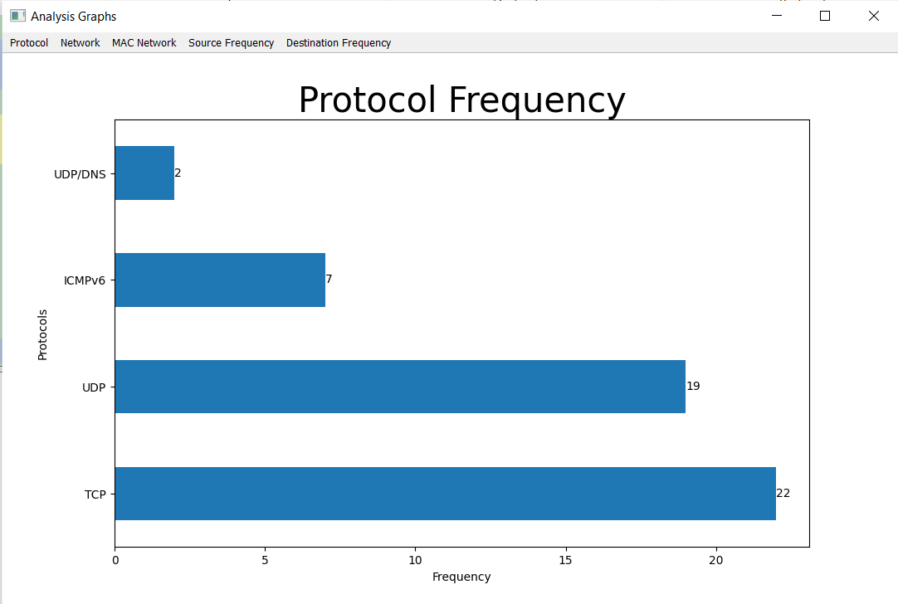
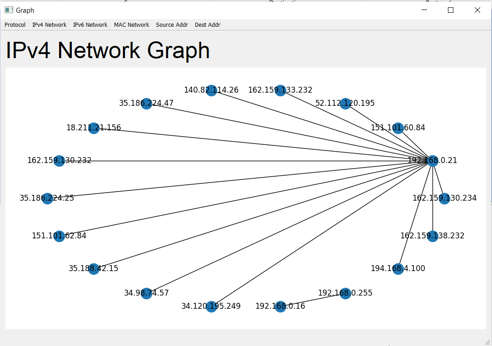
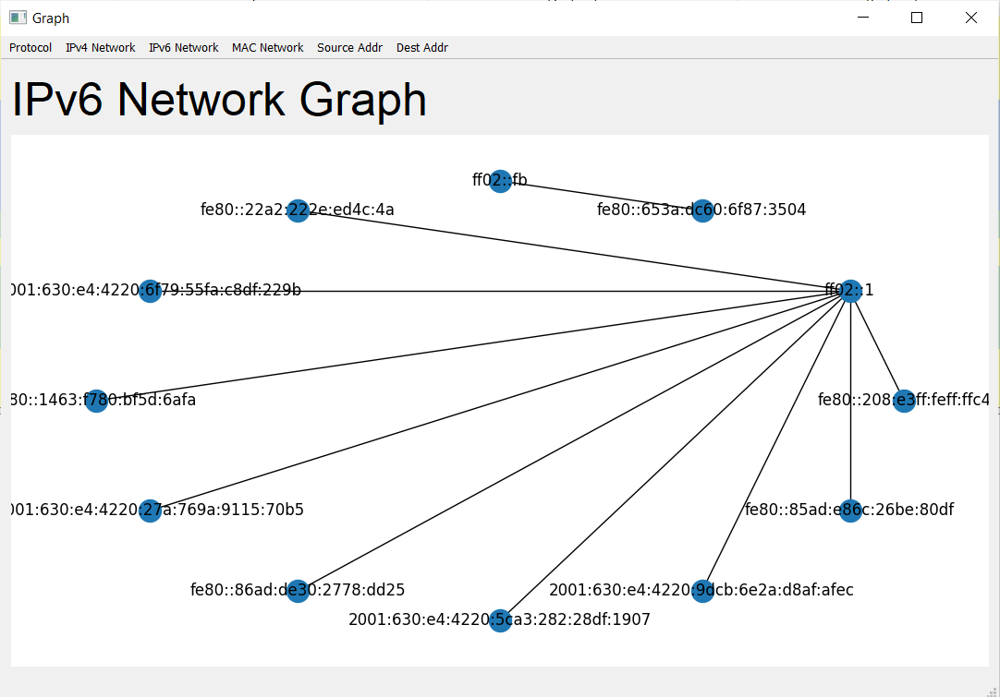
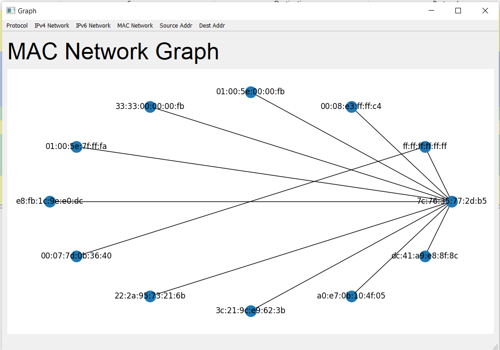
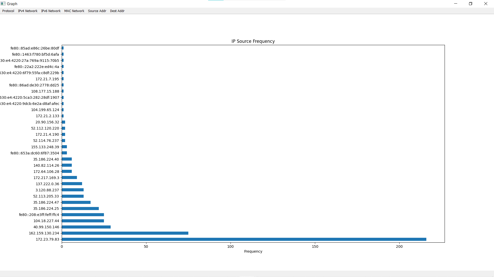
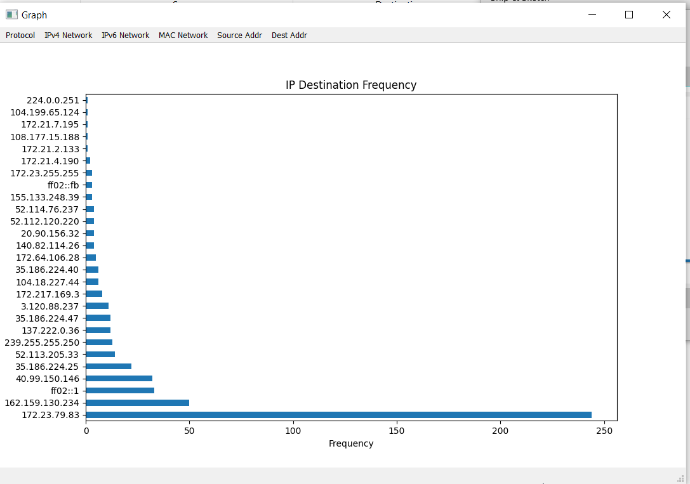

# Graphs<!-- {docsify-ignore} -->

From the captured packets, we can extract attributes in order to plot a variety of graphs.

## Protocol Freqeuency
* Plots freqeuncy of protocols in collected packets

## IPv4 Network Map
* Plots a node map of communicating IPv4 addresses 

## IPv6 Network Map
* Plots a node map of communicating IPv6 addresses

## MAC Address Map
* Plots a node map of MAC addresses

## Source Addr
* Plots frequency of source IP addresses

## Dest Addr
* Plots frequency of destination IP addresses

